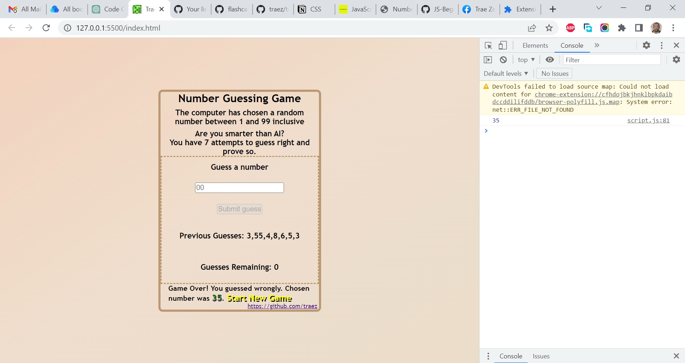

# Jsbeginners.com - Javascript Number Guessing Game Project

This is a solution to the [Javascript Number Guessing Game Project](https://jsbeginners.com/javascript-number-guessing-game/). I am trying to improve my coding skills by building realistic projects. 

## Table of contents

- [Overview](#overview)
  - [The challenge](#the-challenge)
  - [Screenshot](#screenshot)
  - [Links](#links)
  - [My process](#my-process)
  - [Built with](#built-with)
  - [What I learned](#what-i-learned)
  - [Continued development](#continued-development)
  - [Useful resources](#useful-resources)
  - [Author](#author)
  - [Acknowledgments](#acknowledgments)

## Overview

### The challenge

- This objective is to code a game where the user must guess a randomly generated number from 1 to 100. 

### Screenshot

### Links

- Solution URL: [https://github.com/traez/javascript-number-guessing-game-project](https://github.com/traez/javascript-number-guessing-game-project)
- Live Site URL: [https://traez.github.io/javascript-number-guessing-game-project/](https://traez.github.io/javascript-number-guessing-game-project/)

## My process

### Built with

- Semantic HTML5 markup
- CSS custom properties
- Flexbox
- CSS Grid
- Mobile-first workflow
- Vanilla JavaScript

### What I learned

- Proud of myself for this one. The most complex code I've written for a project thus far. Approached the solution like a programmer, and independently created and interconnected the various functions and addEventListeners.  

### Continued development

More practice; continuously and consistently!     

### Useful resources

Stackoverflow  
MDN Web Docs  
w3schools  
YouTube  
Google  
ChatGPT OpenAI chatbot  

## Author

- Website - [Trae Zeeofor](https://github.com/traez)  
- Twitter - [@trae_z](https://twitter.com/trae_z) 

## Acknowledgments

Respect to all the deep thinking programmers!   
